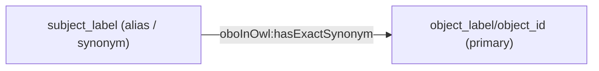
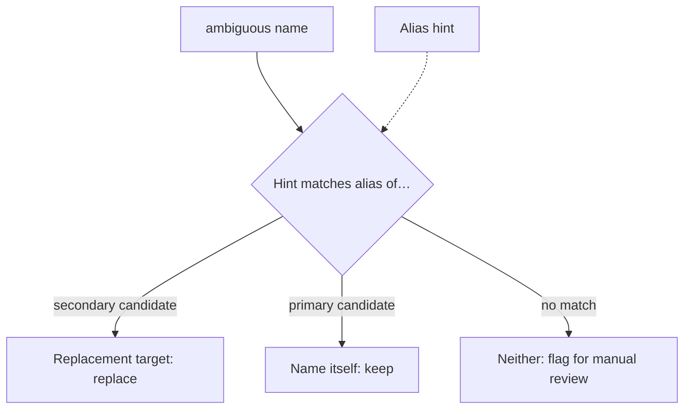

<!--
<p align="center">
  
</p>
-->

<h1 align="center">
  pySec2Pri
</h1>

<p align="center">
    <a href="https://github.com/jmillanacosta/pysec2pri/actions/workflows/tests.yml">
        </a>
    <a href="https://pypi.org/project/pysec2pri">
        </a>
    <a href="https://pypi.org/project/pysec2pri">
        </a>
    <a href="https://github.com/jmillanacosta/pysec2pri/blob/main/LICENSE">
        </a>
    <a href='https://pysec2pri.readthedocs.io/en/latest/?badge=latest'>
        </a>
</p>

Create and use mapping files for secondary (retired/withdrawn) biological
database identifiers and symbols to primary (current) identifiers and symbols.

Outputs mappings in [SSSOM format](https://w3id.org/sssom) by default. Subjects
are secondary, objects are primary.

## Installation

```console
uv pip install pysec2pri
```

Or install from source:

```console
uv pip install git+https://github.com/jmillanacosta/pysec2pri.git
```

## Quick Start

### Generating mapping sets

To obtain the secondary to primary identifier SSSOM mapping set for ChEBI:

```bash
pysec2pri chebi
```

This will automatically download the latest ChEBI release and generate an SSSOM
mapping file in your current directory.

To process locally and specify the output:

```bash
pysec2pri chebi ChEBI_complete_3star.sdf --output my_mappings.sssom.tsv
```

For more options and help on any command:

```bash
pysec2pri --help
pysec2pri chebi --help
```

The default output is in [SSSOM](https://mapping-commons.github.io/sssom/)
(Simple Standard for Sharing Ontology Mappings) TSV format.

### Updating IDs and symbols

A generated mapping set can be used to update IDs and symbols in Python:

```python
from pysec2pri import generate_chebi_synonyms, resolve_symbols
cs = generate_chebi_synonyms()
resolve_symbols(["Glucose", "ATP", "Guanine"], cs)
```

Or from the command line, given a TSV file `gene_ex.tsv`:

```
gene	data
HGNC:131	3.5
```

Resolve the `gene` column to primary HGNC IDs (a new `_primary` column is
added):

```bash
pysec2pri update-ids gene_ex.tsv hgnc --at gene -o gene_ex_primary.tsv
# gene        data    gene_primary
# HGNC:131    3.5     HGNC:145
```

The same pattern works for symbols with `update-symbols`, and multiple columns
can be resolved by repeating `--at`:

```bash
pysec2pri update-ids data.tsv hgnc --at gene_id --at related_gene_id
```

To skip regenerating the mapping set, pass a pre-built mapping file:

```bash
pysec2pri hgnc ids  # outputs hgnc_{version}_sssom.tsv
pysec2pri update-ids gene_ex.tsv hgnc --at gene --mapping hgnc_{version}_sssom.tsv
```

Ambiguous mappings (where a deprecated ID or symbol serves as a recommended for
another entity) are not resolved, but flagged for users to solve them manually.
If the input file has a column of known aliases or synonyms for each row, pass
it as a hint to resolve ambiguous names automatically:

```bash
pysec2pri update-ids data.tsv hgnc --at gene_id --synonyms gene_aliases
# Pairs gene_aliases hints with gene_id; repeat --at X--synonyms Y for more columns.
```

A subset with ambiguous mappings only can be generated like:

```bash
pysec2pri ambiguous hgnc-symbols
```

## Mapping types

### Deprecations (IDs)

A deprecated ID is mapped to its replacement via `IAO:0100001` ("term replaced
by"). Each row is 1-to-1: one secondary `subject_id` : one primary `object_id`.


**Ambiguity** happens when the same ID appears as both a `subject_id`
(secondary) and an `object_id` (primary) across different mappings.


### Symbols

The same 1-to-1 pattern applies to symbol (label) mappings: a previous or alias
symbol (`subject_label`) maps to the current symbol (`object_label`) of the same
entity via `IAO:0100001`.

**Ambiguity** appears when the same symbol is both a `subject_label` (previous
name, secondary) and an `object_label` (current name, primary) across different
mappings.

### Aliases / synonyms

Alias mappings use `oboInOwl:hasExactSynonym`. The alias is the `subject_label`
and the authoritative name is the `object_label`/`object_id`.



### Resolving ambiguity with alias hints

When a name is ambiguous, alias mappings are used as evidence. For each
candidate interpretation the resolver checks whether any user-supplied hint
matches a known alias of that candidate's primary entity. A hit on the secondary
candidate's target confirms the name is being used as a previous name; a hit on
the primary candidate's own aliases confirms it is already current.



## Documentation

Full documentation: <https://pysec2pri.readthedocs.io/>

## Supported Databases

| Datasource | license                                                                                                                            | citation                                                                                                                                                                                                                                                                                                                                                                                                                                                                                                                                                                                                      |
| ---------- | ---------------------------------------------------------------------------------------------------------------------------------- | ------------------------------------------------------------------------------------------------------------------------------------------------------------------------------------------------------------------------------------------------------------------------------------------------------------------------------------------------------------------------------------------------------------------------------------------------------------------------------------------------------------------------------------------------------------------------------------------------------------- |
| ChEBI      | [CC BY 4.0](docs/licenses/chebi/LICENSE).                                                                                          | Hastings J, Owen G, Dekker A, et al. ChEBI in 2016: Improved services and an expanding collection of metabolites. Nucleic Acids Research. 2016 Jan;44(D1):D1214-9. DOI: [10.1093/nar/gkv1031](https://doi.org/10.1093/nar/gkv1031). PMID: 26467479; PMCID: PMC4702775.                                                                                                                                                                                                                                                                                                                                        |
| HMDB       | [CC BY 4.0](https://hmdb.ca/about#compliance:~:text=international%20scientific%20conferences.-,Citing%20the%20HMDB,-HMDB%20is%20offered) | Wishart DS, Guo A, Oler E, Wang F, Anjum A, Peters H, Dizon R, Sayeeda Z, Tian S, Lee BL, Berjanskii M, Mah R, Yamamoto M, Jovel J, Torres-Calzada C, Hiebert-Giesbrecht M, Lui VW, Varshavi D, Varshavi D, Allen D, Arndt D, Khetarpal N, Sivakumaran A, Harford K, Sanford S, Yee K, Cao X, Budinski Z, Liigand J, Zhang L, Zheng J, Mandal R, Karu N, Dambrova M, Schiöth HB, Greiner R, Gautam V. HMDB 5.0: the Human Metabolome Database for 2022. Nucleic Acids Res. 2022 Jan 7;50(D1):D622-D631. doi: [10.1093/nar/gkab1062](https://doi.org/10.1093/nar/gkab1062). PMID: 34986597; PMCID: PMC8728138. |
| HGNC       | [link](https://www.genenames.org/about/license/)                                                                                   | Seal RL, Braschi B, Gray K, Jones TEM, Tweedie S, Haim-Vilmovsky L, Bruford EA. Genenames.org: the HGNC resources in 2023. Nucleic Acids Res. 2023 Jan 6;51(D1):D1003-D1009. doi: [10.1093/nar/gkac888](https://doi.org/10.1093/nar/gkac888). PMID: 36243972; PMCID: PMC9825485.                                                                                                                                                                                                                                                                                                                              |
| NCBI       | [link](https://www.ncbi.nlm.nih.gov/home/about/policies/)                                                                          | Sayers EW, Bolton EE, Brister JR, Canese K, Chan J, Comeau DC, Connor R, Funk K, Kelly C, Kim S, Madej T, Marchler-Bauer A, Lanczycki C, Lathrop S, Lu Z, Thibaud-Nissen F, Murphy T, Phan L, Skripchenko Y, Tse T, Wang J, Williams R, Trawick BW, Pruitt KD, Sherry ST. Database resources of the national center for biotechnology information. Nucleic Acids Res. 2022 Jan 7;50(D1):D20-D26. doi: [10.1093/nar/gkab1112](https://doi.org/10.1093/nar/gkab1112). PMID: 34850941; PMCID: PMC8728269.                                                                                                        |
| UniProt    | [CC BY 4.0](https://ftp.uniprot.org/pub/docs/licenses/uniprot/current_release/knowledgebase/complete/LICENSE)                      | UniProt Consortium. UniProt: the universal protein knowledgebase in 2021. Nucleic Acids Res. 2021 Jan 8;49(D1):D480-D489. doi: [10.1093/nar/gkaa1100](https://doi.org/10.1093/nar/gkaa1100). PMID: 33237286; PMCID: PMC7778908.                                                                                                                                                                                                                                                                                                                                                                               |
| Wikidata   |                                                                                                                                    | Vrandecic, D., Krotzsch, M. Wikidata: a free collaborative knowledgebase. Communications of the ACM. 2014. doi: [10.1145/2629489](https://doi.org/10.1145/2629489).                                                                                                                                                                                                                                                                                                                                                                                                                                           |

## License

MIT License. See [LICENSE](LICENSE) for details.
