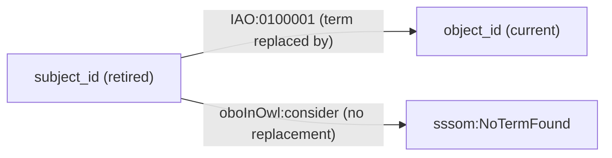
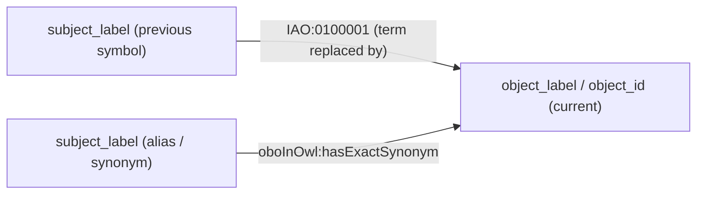
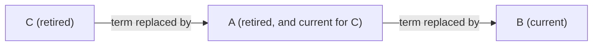
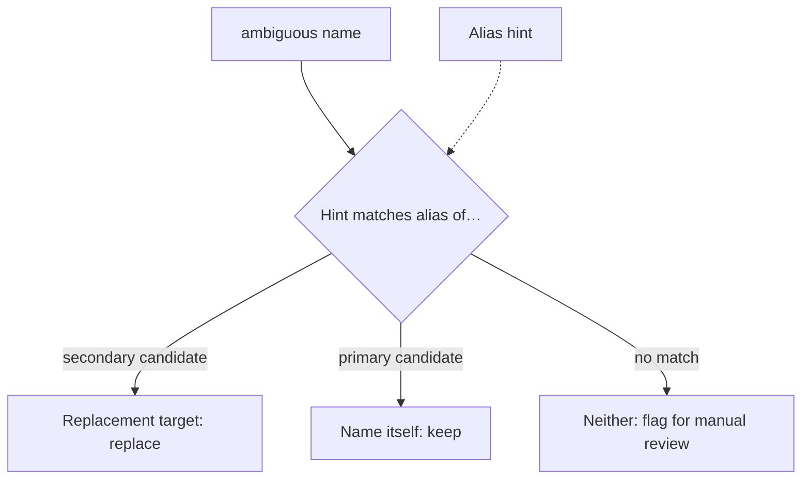

<!--
<p align="center">
  
</p>
-->

<h1 align="center">
  pySec2Pri
</h1>

<p align="center">
    <a href="https://github.com/jmillanacosta/pysec2pri/actions/workflows/tests.yml">
        </a>
    <a href="https://pypi.org/project/pysec2pri">
        </a>
    <a href="https://pypi.org/project/pysec2pri">
        </a>
    <a href="https://github.com/jmillanacosta/pysec2pri/blob/main/LICENSE">
        </a>
    <a href='https://pysec2pri.readthedocs.io/'>
        </a>
</p>

Create and use mapping files for secondary (retired/withdrawn) biological
database identifiers and labels to primary (current) identifiers and labels.

Outputs mappings in [SSSOM format](https://w3id.org/sssom) by default. Subject
ids and labels (`subject_id`, `subject_label`) are secondary, objects are
primary.

## Installation

```console
uv pip install pysec2pri
```

Or install from source:

```console
uv pip install git+https://github.com/jmillanacosta/pysec2pri.git
```

## Quick Start

### Generating mapping sets

Most sources have two commands. `ids` maps retired identifiers to current ones,
`labels` maps old labels to current ones:

```bash
pysec2pri hgnc ids
pysec2pri hgnc labels
```

#### Data output:

The created mapping files are automatically added in your current working
directory. Use the `-o` flag to write to a different location, e.g.
`pysec2pri hgnc ids -o out.sssom.tsv` or `-o some_dir/`.

Run `pysec2pri --help` to see every source, and `pysec2pri <source> ids --help`
for one source's options. Input files are downloaded unless you pass them:

```bash
pysec2pri hgnc ids --withdrawn withdrawn.txt --complete hgnc_complete_set.txt
```

In Python there are two functions, one per kind:

```python
from pysec2pri import generate_ids, generate_labels, sources

sources()          # every source
sources("labels")  # sources with labels

hgnc = generate_ids("hgnc")
chebi = generate_labels("chebi", subset="3star", version="350")
ensembl = generate_ids("ensembl", version="115", species="9606")
```

Both return an SSSOM `MappingSet`: `IdMappingSet` or `LabelMappingSet`. Subjects
are secondary, objects are primary. Options that a source does not have are
ignored, so `species` on HGNC does nothing.

The default output is [SSSOM](https://mapping-commons.github.io/sssom/) TSV.

### Updating IDs and labels

Use a mapping set to update your own data. Labels:

```python
from pysec2pri import generate_labels, resolve_labels
chebi = generate_labels("chebi")
resolve_labels(["Glucose", "ATP", "Guanine"], chebi)
```

Identifiers in a dataframe:

```python
from pysec2pri import generate_ids, update_ids
ensembl = generate_ids("ensembl", version="115", species="9606")
df_with_new_column = update_ids(mapping_set=ensembl, ids=df, at="Ensembl_id")  # `at` is the column name
```

Or from the command line, given a TSV file `gene_ex.tsv`:

```
gene	data
HGNC:131	3.5
```

Resolve the `gene` column to primary HGNC IDs (a new `_primary` column is
added):

```bash
pysec2pri update-ids gene_ex.tsv hgnc --at gene -o gene_ex_primary.tsv
# gene        data    gene_primary
# HGNC:131    3.5     HGNC:145
```

The same pattern works for labels with `update-labels`, and multiple columns can
be resolved by repeating `--at`:

```bash
pysec2pri update-ids data.tsv hgnc --at gene_id --at related_gene_id
```

To skip regenerating the mapping set, pass a pre-built mapping file:

```bash
pysec2pri hgnc ids  # outputs hgnc_ids_{version}.sssom.tsv
pysec2pri update-ids gene_ex.tsv hgnc --at gene --mapping hgnc_ids_{version}.sssom.tsv
```

In Python, `load_mapping` reads a written SSSOM file back in, so you can
generate once and reuse the file:

```python
from pysec2pri import load_mapping, update_ids
hgnc = load_mapping("hgnc_ids_115.sssom.tsv")
df_with_new_column = update_ids(mapping_set=hgnc, ids=df, at="gene")
```

Use `load_label_mapping` for a label mapping set.

Ambiguous mappings (where a deprecated ID or label serves as a recommended for
another entity) are not resolved, but flagged for users to solve them manually.
If the input file has a column of known aliases or synonyms for each row, pass
it as a hint to resolve ambiguous names automatically:

```bash
pysec2pri update-ids data.tsv hgnc --at gene_id --synonyms gene_aliases
# Pairs gene_aliases hints with gene_id; repeat --at X--synonyms Y for more columns.
```

A subset with ambiguous mappings only can be generated like:

```bash
pysec2pri ambiguous hgnc-labels
```

## Mapping types

Every row is one secondary (`subject`) and one primary (`object`). Which
predicate joins them says what happened to it.

### IDs

A retired ID either has a replacement or does not:


```mermaid
flowchart LR
    S["subject_id (retired)"]
    P["object_id (current)"]
    N["sssom:NoTermFound"]
    S -->|"IAO:0100001 (term replaced by)"| P
    S -->|"oboInOwl:consider (no replacement)"| N
```

`mapping_cardinality` says how the two sides line up: `1:1`, `n:1` when several
retired IDs were merged into one, `1:0` for a withdrawal with no replacement.

### Labels

One label mapping set holds both of a source's label changes, told apart by
predicate:


```mermaid
flowchart LR
    PREV["subject_label (previous symbol)"]
    ALIAS["subject_label (alias / synonym)"]
    CUR["object_label / object_id (current)"]
    PREV -->|"IAO:0100001 (term replaced by)"| CUR
    ALIAS -->|"oboInOwl:hasExactSynonym"| CUR
```

A previous symbol is one the entity used to have. An alias is another name it
still goes by. Only the first is a rename; the second is what the resolver uses
as evidence below.

### Looking further back with `--consolidate`

`--consolidate` reads all of the source's past releases, finds mappings the
current release no longer mentions, and gives every mapping the release it first
appeared in:

```bash
pysec2pri hgnc ids --consolidate -o hgnc.sssom.tsv
```

```python
from pysec2pri import generate_ids, supports_consolidate
supports_consolidate("hgnc", "ids")
generate_ids("hgnc", consolidate=True)
```

### Ambiguity

A value is ambiguous when it is retired in one row and current in another. This
is not resolved: the row is flagged and left alone.


```mermaid
flowchart LR
    C["C (retired)"] -->|term replaced by| A["A (retired, and current for C)"]
    A -->|term replaced by| B["B (current)"]
```

The same holds for labels: a symbol can be a `subject_label` (someone's old
name) and an `object_label` (someone else's current name).

### Resolving ambiguity with alias/synonym hints

When a name is ambiguous, alias mappings are used as evidence. For each
candidate interpretation the resolver checks whether any user-supplied hint
matches a known alias of that candidate's primary entity. A hit on the secondary
candidate's target confirms the name is being used as a previous name; a hit on
the primary candidate's aliases confirms it is already current.


```mermaid
flowchart TD
    Name["ambiguous name"]
    Hint["Alias hint"]
    Check{"Hint matches alias of…"}
    SecPath["Replacement target: replace"]
    PriPath["Name itself: keep"]
    Blank["Neither: flag for manual review"]
    Name --> Check
    Hint -.-> Check
    Check -->|secondary candidate| SecPath
    Check -->|primary candidate| PriPath
    Check -->|no match| Blank
```

### Disambiguation with context (label / id / xref)

Alias hints are one kind of _context_: a per-row piece of independent evidence
that helps decide which entity an ambiguous name actually means. `update_ids`
and `update_labels` support three kinds, via `ContextSpec`:

- **`label`** -- an alias/synonym string (the `synonyms=`/`--synonyms` shown
  above).
- **`id`** -- a related/foreign identifier string, matched the same way.
- **`xref`** -- a cross-reference token (e.g. an Ensembl ID) resolved through an
  independent crosswalk table (`XrefMapping`).

All three only ever touch cells already flagged ambiguous, and every attempt can
be written to an auditable decision log:

```python
from pysec2pri import generate_labels, load_xref_mapping, update_labels

label_ms = generate_labels("hgnc")
ensembl_to_hgnc = load_xref_mapping("ensembl_to_hgnc.tsv")  # subject_id/object_id/object_label

resolved = update_labels(
    df, label_ms, at="gene_name",
    xref="ensembl",                # column with each row's Ensembl ID
    xref_mapping=ensembl_to_hgnc,
    report_path="decisions.tsv",   # stage, token, predicate_id, candidate, accepted, reason
)
```

The same options are available on the CLI:

```bash
pysec2pri update-labels genes.tsv hgnc --at gene_name \
  --xref ensembl --xref-source hgnc_custom --xref-on ensembl \
  --report decisions.tsv
```

### Crosswalk tables

`--xref-source` names a table listed in the source's config. `hgnc_custom` is
HGNC download, one row per gene:

| HGNC ID    | Approved symbol | Status           | Previous symbols            | NCBI Gene ID | Ensembl ID      | UniProt ID |
| ---------- | --------------- | ---------------- | --------------------------- | ------------ | --------------- | ---------- |
| HGNC:5     | A1BG            | Approved         |                             | 1            | ENSG00000121410 | P04217     |
| HGNC:37133 | A1BG-AS1        | Approved         | NCRNA00181, A1BGAS, A1BG-AS | 503538       | ENSG00000268895 |            |
| HGNC:6     | A1S9T           | Symbol Withdrawn |                             |              |                 |            |
| HGNC:7     | A2M             | Approved         |                             | 2            | ENSG00000175899 | P01023     |

Two columns of it are already a crosswalk: pick `Ensembl ID` and `HGNC ID` and
you can map one to the other with
`--xref ensembl --xref-source hgnc_custom --xref-on ensembl`

#### Bringing your own table

Pass any table with `--xref-file`. It needs three columns: `subject_id` (what
you key on), `object_id` (this source's identifier), and `object_label` (its
label):

```text
subject_id         object_id   object_label
ENSG00000121410    HGNC:5      A1BG
ENSG00000175899    HGNC:7      A2M
```

```bash
pysec2pri update-ids genes.tsv hgnc --at gene_id --xref ensembl \
  --xref-file my_crosswalk.tsv
```

In Python you can point at the columns instead of renaming them, so a file like
HGNC download works like:

```python
from pysec2pri import generate_ids, load_xref_mapping, update_ids

xref = load_xref_mapping(
    "hgnc_custom.tsv",
    subject_col="Ensembl ID(supplied by Ensembl)",
    object_col="HGNC ID",
    object_label_col="Approved symbol",
)
update_ids(df, generate_ids("hgnc"), at="gene_id", xref="ensembl", xref_mapping=xref)
```

### Diffing mapping sets

`diff` compares two SSSOM files (e.g. two releases of the same mapping set) and
reports added/removed/changed rows:

```bash
pysec2pri diff old.sssom.tsv new.sssom.tsv --datasource hgnc -o diff.tsv
```

## Documentation

Full documentation: <https://pysec2pri.readthedocs.io/>

## Supported Databases

| Datasource | license                                                                                                                                     | citation                                                                                                                                                                                                                                                                                                                                                                                                                                                                                                                                                                                                      |
| ---------- | ------------------------------------------------------------------------------------------------------------------------------------------- | ------------------------------------------------------------------------------------------------------------------------------------------------------------------------------------------------------------------------------------------------------------------------------------------------------------------------------------------------------------------------------------------------------------------------------------------------------------------------------------------------------------------------------------------------------------------------------------------------------------- |
| ChEBI      | [CC BY 4.0](docs/licenses/chebi/LICENSE).                                                                                                   | Hastings J, Owen G, Dekker A, et al. ChEBI in 2016: Improved services and an expanding collection of metabolites. Nucleic Acids Research. 2016 Jan;44(D1):D1214-9. DOI: [10.1093/nar/gkv1031](https://doi.org/10.1093/nar/gkv1031). PMID: 26467479; PMCID: PMC4702775.                                                                                                                                                                                                                                                                                                                                        |
| Ensembl    | [link](https://www.ensembl.org/info/about/legal/disclaimer.html)                                                                            | Martin FJ, Amode MR, Aneja A, et al. Ensembl 2023. Nucleic Acids Res. 2023 Jan 6;51(D1):D933-D941. doi: [10.1093/nar/gkac958](https://doi.org/10.1093/nar/gkac958). PMID: 36318249; PMCID: PMC9825606.                                                                                                                                                                                                                                                                                                                                                                                                        |
| HMDB       | [CC BY-NC 4.0](https://hmdb.ca/about#compliance:~:text=international%20scientific%20conferences.-,Citing%20the%20HMDB,-HMDB%20is%20offered) | Wishart DS, Guo A, Oler E, Wang F, Anjum A, Peters H, Dizon R, Sayeeda Z, Tian S, Lee BL, Berjanskii M, Mah R, Yamamoto M, Jovel J, Torres-Calzada C, Hiebert-Giesbrecht M, Lui VW, Varshavi D, Varshavi D, Allen D, Arndt D, Khetarpal N, Sivakumaran A, Harford K, Sanford S, Yee K, Cao X, Budinski Z, Liigand J, Zhang L, Zheng J, Mandal R, Karu N, Dambrova M, Schiöth HB, Greiner R, Gautam V. HMDB 5.0: the Human Metabolome Database for 2022. Nucleic Acids Res. 2022 Jan 7;50(D1):D622-D631. doi: [10.1093/nar/gkab1062](https://doi.org/10.1093/nar/gkab1062). PMID: 34986597; PMCID: PMC8728138. |
| HGNC       | [CC0](https://creativecommons.org/publicdomain/zero/1.0/)                                                                                   | Seal RL, Braschi B, Gray K, Jones TEM, Tweedie S, Haim-Vilmovsky L, Bruford EA. Genenames.org: the HGNC resources in 2023. Nucleic Acids Res. 2023 Jan 6;51(D1):D1003-D1009. doi: [10.1093/nar/gkac888](https://doi.org/10.1093/nar/gkac888). PMID: 36243972; PMCID: PMC9825485.                                                                                                                                                                                                                                                                                                                              |
| NCBI       | [link](https://www.ncbi.nlm.nih.gov/home/about/policies/)                                                                                   | Sayers EW, Bolton EE, Brister JR, Canese K, Chan J, Comeau DC, Connor R, Funk K, Kelly C, Kim S, Madej T, Marchler-Bauer A, Lanczycki C, Lathrop S, Lu Z, Thibaud-Nissen F, Murphy T, Phan L, Skripchenko Y, Tse T, Wang J, Williams R, Trawick BW, Pruitt KD, Sherry ST. Database resources of the national center for biotechnology information. Nucleic Acids Res. 2022 Jan 7;50(D1):D20-D26. doi: [10.1093/nar/gkab1112](https://doi.org/10.1093/nar/gkab1112). PMID: 34850941; PMCID: PMC8728269.                                                                                                        |
| UniProt    | [CC BY 4.0](https://ftp.uniprot.org/pub/docs/licenses/uniprot/current_release/knowledgebase/complete/LICENSE)                               | UniProt Consortium. UniProt: the universal protein knowledgebase in 2021. Nucleic Acids Res. 2021 Jan 8;49(D1):D480-D489. doi: [10.1093/nar/gkaa1100](https://doi.org/10.1093/nar/gkaa1100). PMID: 33237286; PMCID: PMC7778908.                                                                                                                                                                                                                                                                                                                                                                               |
| VGNC       | [CC0](https://creativecommons.org/publicdomain/zero/1.0/)                                                                                   | Tweedie S, Braschi B, Gray KA, Jones TEM, Seal RL, Yates B, Bruford EA. Genenames.org: the HGNC and VGNC resources in 2021. Nucleic Acids Res. 2021 Jan 8;49(D1):D939-D946. doi: [10.1093/nar/gkaa980](https://doi.org/10.1093/nar/gkaa980). PMID: 33152070; PMCID: PMC7779007.                                                                                                                                                                                                                                                                                                                               |
| Wikidata   | [CC0](https://www.wikidata.org/wiki/Wikidata:Licensing)                                                                                     | Vrandecic, D., Krotzsch, M. Wikidata: a free collaborative knowledgebase. Communications of the ACM. 2014. doi: [10.1145/2629489](https://doi.org/10.1145/2629489).                                                                                                                                                                                                                                                                                                                                                                                                                                           |

## License

MIT License. See [LICENSE](LICENSE) for details.
